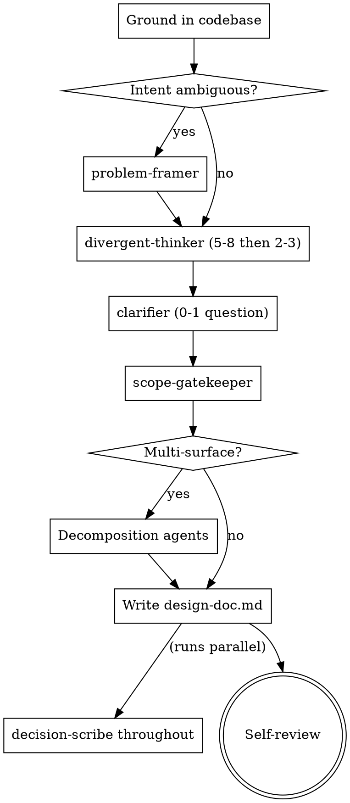

> Adapted from obra/superpowers (MIT). Modifications: removed "is this worth building" scope check, removed visual-companion section, prepended codebase-grounding requirement, added clarifier ban list, condensed to under 300 lines. See refs/superpowers/lib/brainstorming/ for the upstream.

# Brainstorming: Ideas Into Designs

Turn intent into a design doc. Divergent-then-convergent. No scope-evaluation gate — if the user showed up with an idea, it is worth building.

<HARD-GATE>
Do NOT invoke any implementation skill, write any code, or take any implementation action until you have produced a design doc. The design can be short (a few paragraphs), but it MUST exist before `/write-plan` runs.
</HARD-GATE>

## Prerequisite: Codebase grounding

Before the first question or approach, apply `lib/codebase-grounding/SKILL.md`:

1. Read `CLAUDE.md` in the working repo if present.
2. Top-level directory listing. Identify stack from config files.
3. Read one representative file per layer (model, view, component) before proposing changes.
4. `git log --oneline -20` for active work.

Never ask the user anything resolvable by the above.

## Checklist

Create a todo per item, complete in order:

1. **Ground in the codebase** (see above).
2. **Frame the problem** (only if intent is ambiguous; skip for specific feature requests). Use problem-framer agent.
3. **Diverge**: generate 5-8 approaches, filter to 2-3 finalists, in ONE response. Use divergent-thinker agent.
4. **Clarify**: at most one question if genuinely irreversible, else pick one and move on. Use clarifier agent.
5. **Scope gate**: if multi-subsystem, split and continue with one. Use scope-gatekeeper agent.
6. **Decomposition** (conditional): functional-decomposer, event-mapper, contract-first-architect, walking-skeleton-planner.
7. **Record decisions** throughout via decision-scribe (MADR-format ADRs).
8. **Write design doc** to `docs/plans/<slug>/design-doc.md`.
9. **Self-review** for placeholders and contradictions. Fix inline. Do not present to user for approval — `/plan` orchestrates that.

## Process flow



## Clarifier ban list (HARD)

Never ask:
- "What tech stack should I use?" (read `package.json` / `pyproject.toml`)
- "Should I follow best practices?" (obviously)
- "Do you want tests?" (yes, always)
- "What code style do you prefer?" (read CLAUDE.md / existing files)
- "Are you sure?" / "Should I proceed?"
- "Would you like me to also…" (just do it if it's in scope)
- Any question whose answer is in CLAUDE.md or the plan so far

Ask one question only if all three hold:
1. The choice is genuinely irreversible.
2. The user has a stake the plugin can't infer.
3. No file, command, or web search would resolve it.

Default behavior: don't ask.

## Divergent then convergent in one pass

Generate 5-8 approaches. Each: one sentence strategy + one sentence trade-off. Include at least one unusual option (contrarian, radical simplification, inverted constraint). Score each on fit / ship-time / reversibility / elegance (one word each: good / ok / bad). Pick top 2-3. State why in one line.

No pause between generating and filtering. Single response.

## Design doc format

Write to `docs/plans/<slug>/design-doc.md`:

```markdown
# Design: <topic>

## Problem
<one paragraph, lifted from problem-statement.md if it exists, else derived>

## Chosen approach
<the finalist>

## Alternatives considered
<the other 1-2 finalists, one line each, why rejected>

## Architecture sketch
<C4 context + container sketch, references/methodologies/c4-model.md>

## Contracts (if pipeline/workflow)
<from contract-first-architect if invoked>

## Event flow (if workflow)
<from event-mapper if invoked>

## Functional decomposition (if multi-surface)
<tree from functional-decomposer if invoked>

## Scope note
This covers: ...
Deferred: ...

## Decisions
<one line per ADR, links to decisions/*.md>

## Open questions for plan-writer
<only real gaps, not best-practices questions>
```

## Self-review before handoff

Scan for: `TBD`, `TODO`, `FIXME`, contradictions (e.g., "use Postgres" in one section and "use SQLite" in another), missing sections that the conditional agents would fill, scope drift ("also we'll do X"). Fix inline.

## Terminal state

Emit path to `design-doc.md` in one line. Do NOT invoke `/write-plan` automatically from here — `/plan` orchestrates that. Do NOT prompt the user for approval; `/plan` handles that.
